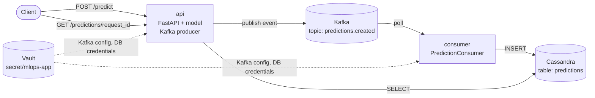

# Dog Emotion Classifier

An MLOps project that classifies dog emotions (`angry`, `happy`, `relaxed`, `sad`) from a photo. A fine-tuned EfficientNet-B0 model is served behind a FastAPI inference service; every prediction is published to **Kafka** and persisted to Cassandra by a separate consumer. The project is versioned with DVC, containerized with Docker, and shipped through CI/CD on GitHub Actions.

## 1. Project Overview

The service takes a dog photo and returns a predicted emotion with a probability distribution over all four classes.

- **Model**: EfficientNet-B0 (`torchvision`), fine-tuned on a labeled dataset of dog photos.
- **Serving**: FastAPI app that loads the trained checkpoint once at startup and exposes `/health`, `/model/info`, `/predict`.
- **CLI**: a single entry point (`src/model.py`) to train the model or run a one-off prediction, without starting the API.
- **Messaging**: Kafka — the API publishes each prediction as an event, a separate `consumer` container writes it to Cassandra (see [Kafka](#8-kafka)).
- **Data & model versioning**: DVC, with a Google Drive remote.
- **Packaging**: Docker / docker-compose.
- **Automation**: CI builds, tests and publishes the Docker image on every PR to `main`; CD starts the whole stack (Vault, Kafka, Cassandra, API, consumer) and runs functional tests — on demand or nightly.

Project layout:

```
mlops_project/
├── config.ini                  # paths & runtime settings (data, model, device)
├── data/                       # dataset (DVC-tracked)
├── expirements/                # trained checkpoints (DVC-tracked)
├── models/                     # legacy / local model artifacts (not DVC-tracked)
├── notebooks/                  # EDA
├── src/
│   ├── api/                    # FastAPI app (main.py, schemas.py)
│   ├── kafka/                  # producer (used by the API) and consumer (separate container)
│   ├── db/                     # Cassandra repository, schema, init script
│   ├── config.py                # config.ini + Vault-backed settings (Cassandra, Kafka)
│   ├── vault.py                 # Vault client
│   ├── model.py                 # dataset, model, training, inference, CLI
│   └── logger.py
├── vault/                      # Vault image, entrypoint, seed script
├── tests/
│   ├── unit/                    # mocked, run in CI against every PR
│   └── functional/               # live HTTP against a deployed container, run in CD
│       └── data/                # sample images and CSV fixtures used by functional tests
├── Dockerfile
├── docker-compose.yml
└── .github/workflows/           # ci.yml, cd.yml
```

## 2. Installation

Requirements: Python 3.10, `pip`.

```bash
git clone https://github.com/banka-lecho/mlops_project.git
cd mlops_project

python3 -m venv mlops_venv
source mlops_venv/bin/activate        # Windows: mlops_venv\Scripts\activate

pip install -r requirements.txt
```

Pull the dataset and the trained checkpoint (see [DVC](#11-dvc) for remote setup):

```bash
dvc pull
```

`config.ini` is the single source of truth for filesystem paths (data and model checkpoint); database credentials and connection settings come from a **HashiCorp Vault** container, never from `config.ini` or the source tree. See [`src/config.py`](src/config.py):

```ini
[DATA]
csv_path = data/dataset.csv
images_path = data/images

[MODEL]
checkpoint_path = expirements/dog_emotion_efficientnet_best.pth
device = cpu
```

### Secrets and connection settings

No database credentials or connection settings live in the source tree. They are stored in a dedicated **HashiCorp Vault** service (third container in [`docker-compose.yml`](docker-compose.yml)) and read at runtime; `config.ini` holds only non-sensitive paths, and there are **no secret-bearing config files to copy** before startup.

**Where the secrets live.** [`vault/Dockerfile`](vault/Dockerfile) bakes an init script into the image at build time; on start [`vault/entrypoint.sh`](vault/entrypoint.sh) launches a dev Vault (`VAULT_TOKEN=root`, hardcoded) and applies [`vault/seed.sh`](vault/seed.sh), which writes the KV‑v2 secret `secret/mlops-app`:

| Key | Meaning |
| --- | --- |
| `CASSANDRA_HOSTS` | Comma-separated hosts (`cassandra` — the compose service name) |
| `CASSANDRA_PORT` | CQL port |
| `CASSANDRA_KEYSPACE` | Keyspace name (`dog_emotion_keyspace`, see [`schema.cql`](src/db/schema.cql)) |
| `CASSANDRA_USER` / `CASSANDRA_PASSWORD` | Unprivileged app role the API uses (`SELECT` + `MODIFY` on the keyspace) |
| `CASSANDRA_BOOTSTRAP_USER` / `CASSANDRA_BOOTSTRAP_PASSWORD` | Cassandra superuser, used only by [`init_db.sh`](src/db/init_db.sh) to apply the schema and create the app role |
| `KAFKA_BOOTSTRAP_SERVERS` | Kafka broker address inside the compose network (`kafka:9092`) |
| `KAFKA_TOPIC_PREDICTIONS` | Topic for prediction events (`predictions.created`) |
| `KAFKA_CONSUMER_GROUP` | Consumer group of the `consumer` service (`dog-emotion-consumer`) |

`vault/seed.sh` and `vault/vault.env` are **gitignored** (only `*.example` templates are committed). CI/CD regenerates them from the templates plus GitHub Secrets — see [CI/CD](#10-cicd).

**How the service reads them.**

- [`src/vault.py`](src/vault.py) — `VaultClient` (the `hvac` library) authenticates with `VAULT_ADDR` + `VAULT_TOKEN` and reads `secret/mlops-app`.
- [`src/config.py`](src/config.py) — `load_vault_secrets()` fetches the secret **lazily on the first DB access** (not at import, so unit tests need no Vault) and caches it. `cassandra_settings()` builds `CassandraSettings` from the Vault response; the password is excluded from `__repr__`, so it cannot leak into logs or tracebacks.
- [`src/db/cassandra_client.py`](src/db/cassandra_client.py) — passes those settings to `PlainTextAuthProvider`; the API and the consumer connect as the unprivileged `emotion_app` role.
- [`src/db/init_db.sh`](src/db/init_db.sh) and the Cassandra healthcheck read the same secret via [`vault/load_secrets.py`](vault/load_secrets.py) (`export`s the KV values).

**Non-secret env vars** still come from [`.env`](.env.example) (`env_file:` in compose), which contains no credentials:

| Variable | Required | Meaning |
| --- | --- | --- |
| `API_PORT` | yes (compose) | Host port the API is published on |
| `CASSANDRA_CONNECT_RETRIES` / `CASSANDRA_RETRY_DELAY` | no | Connection retry tuning (read by `cassandra_settings()`) |

`cp .env.example .env` is enough; there are no values to fill in.

**Running outside compose** (Vault + Cassandra reachable on the host):

```bash
VAULT_ADDR=http://127.0.0.1:8200 VAULT_TOKEN=root python -m src.db.load_dataset
```

## 3. Dataset

- **Source files** (DVC-tracked): [`data/dataset.csv`](data/dataset.csv), [`data/clean_dataset.csv`](data/clean_dataset.csv), [`data/images/`](data/images).
- **Format**: one row per image — `label, image_name`. Images live in `data/images/<image_name>`.
- **Classes**: `angry`, `happy`, `relaxed`, `sad` — 4 emotion labels, roughly balanced (~930–990 images per class, 3,876 images total).
- **EDA**: [`notebooks/eda.ipynb`](notebooks/eda.ipynb).

`DogEmotionDataset` ([`src/model.py`](src/model.py)) reads the CSV, builds a `label <-> id` mapping, and applies the standard ImageNet resize/normalize transform (plus augmentation for training: horizontal flip, rotation, color jitter).

## 4. CLI Usage

`src/model.py` is both a library and a CLI entry point, guarded by `if __name__ == "__main__":`. It exposes two subcommands via `argparse`:

```bash
python -m src.model --help
python -m src.model train --help
python -m src.model predict --help
```

Both subcommands default their paths to whatever is configured in `config.ini` (via `path_from_config()` and `checkpoint_path()` in `src/config.py`), and every default can be overridden with a flag. See [Training](#5-training) and [Predict single image](#6-predict-single-image-api-and-cli) below for concrete examples.

## 5. Training

```bash
python -m src.model train --epochs 20 [--csv-path data/dataset.csv] [--img-path data/images]
```

What `DogEmotionClassifierService.train()` does:

1. Loads the CSV, stratified 80/20 train/val split (`random_state=42`).
2. Builds an EfficientNet-B0 (`ImageNet` pretrained weights) with the classifier head replaced for 4 classes.
3. Trains with `AdamW` + `CosineAnnealingLR`, tracking weighted/macro F1 on the validation split each epoch.
4. Saves the best checkpoint (by weighted F1) to `dog_emotion_efficientnet_best.pth` in the current working directory — `model_state_dict`, `label2id`, `id2label`.
5. After training, reloads the best checkpoint and prints a full classification report + confusion matrix on the validation set (see [Model Metrics](#12-model-metrics)).

To make the checkpoint pick up automatically for serving/inference, move it into `expirements/` (matching `config.ini`'s `checkpoint_path`) and re-track it with DVC:

```bash
mv dog_emotion_efficientnet_best.pth expirements/
dvc add expirements/dog_emotion_efficientnet_best.pth
dvc push
```

## 6. Predict single image (API and CLI)

**Via the CLI** — loads the checkpoint directly, no server needed:

```bash
python -m src.model predict --image path/to/dog.jpg [--checkpoint expirements/dog_emotion_efficientnet_best.pth] [--device cpu]
```

Prints the predicted class and per-class probabilities, sorted by confidence.

**Via the API** — start the server (see [API](#7-api)) then:

```bash
curl -X POST http://localhost:8000/predict \
  -F "image=@tests/functional/data/happy_dog.jpg"
```

```json
{
  "request_id": "3f1e7c2a-8a5b-4c1d-9e2f-0a1b2c3d4e5f",
  "predicted_class": "happy",
  "probabilities": {
    "angry": 0.0002,
    "happy": 0.9997,
    "relaxed": 0.0001,
    "sad": 0.0002
  },
  "process_time_ms": 53.2,
  "published": true
}
```

`published: true` means the prediction was sent to Kafka; the stored record becomes available a moment later via `GET /predictions/{request_id}` (see [Kafka](#8-kafka)).

## 7. API

FastAPI app: [`src/api/main.py`](src/api/main.py). Run locally:

```bash
uvicorn src.api.main:app --host 0.0.0.0 --port 8000
```

The model checkpoint is loaded once at startup (`lifespan`), from the path resolved by `checkpoint_path()` out of `config.ini`. The same `lifespan` opens the Cassandra connection (used for reads) and starts the Kafka producer. If either is unreachable the service still starts and serves predictions, reporting `db_connected: false` / `kafka_connected: false`.

| Method | Path          | Description                                                                   |
|--------|---------------|--------------------------------------------------------------------------------|
| GET    | `/health`     | Liveness/readiness check — `status` (`ok`/`degraded`), `model_loaded`, `db_connected`, `kafka_connected` |
| GET    | `/model/info` | Checkpoint path, device, class list, readiness                                |
| POST   | `/predict`    | `multipart/form-data` with an `image` file → predicted class + probabilities; publishes the result to Kafka |
| GET    | `/predictions/{request_id}` | Reads a stored prediction back from Cassandra; `404` until the consumer has written it |

If the model failed to load, `/model/info` and `/predict` return **503** (`ModelNotLoadedError`). Every response carries an `X-Process-Time-Ms` header. Interactive docs are auto-generated by FastAPI at `/docs`.

## 8. Kafka

Kafka decouples inference from storage. The API only computes a prediction and publishes it as an event; a separate **consumer** container reads the topic and writes the result to Cassandra. The API never blocks on the database, and events wait in the topic if Cassandra is temporarily unavailable.



### Components

| Component | Where | What it does |
| --- | --- | --- |
| Broker | `kafka` service, `apache/kafka:4.2.0` | Single node in KRaft mode (broker + controller, no ZooKeeper), listener `kafka:9092`, topics are auto-created with 1 partition |
| Producer | [`src/kafka/producer.py`](src/kafka/producer.py), inside the `api` container | `aiokafka` producer with `acks="all"` and JSON serialization. Started in the API `lifespan`; `/predict` publishes one event per prediction |
| Consumer | [`src/kafka/consumer.py`](src/kafka/consumer.py), separate `consumer` container | Same Docker image as the API, started with `python -m src.kafka.consumer`. Connects to Cassandra, subscribes to the topic and saves every event with `CassandraRepository.save_prediction()` |

### Topic and event format

Topic `predictions.created`, consumer group `dog-emotion-consumer`. Each event carries everything the consumer needs to write a row to `predictions` — it never calls back to the API:

```json
{
  "request_id": "3f1e7c2a-8a5b-4c1d-9e2f-0a1b2c3d4e5f",
  "created_at": "2026-09-11T10:00:00.123456+00:00",
  "image_name": "happy_dog.jpg",
  "predicted_class": "happy",
  "probabilities": {"angry": 0.0002, "happy": 0.9997, "relaxed": 0.0001, "sad": 0.0002},
  "process_time_ms": 53.2,
  "model_checkpoint": "/app/expirements/dog_emotion_efficientnet_best.pth",
  "device": "cpu"
}
```

`request_id` is the primary key of the `predictions` table, so writing the same event twice is a harmless upsert.

### Secrets

Kafka settings live in Vault next to the Cassandra credentials (`KAFKA_*` keys in `secret/mlops-app`, see [Secrets](#secrets-and-connection-settings)). `kafka_settings()` in [`src/config.py`](src/config.py) reads them through the same `load_vault_secrets()` as `cassandra_settings()`.

Neither the `api` nor the `consumer` container receives Kafka settings or database credentials as environment variables — only `VAULT_ADDR`, `VAULT_TOKEN` and `VAULT_SECRET_PATH`. The consumer writes to Cassandra as the unprivileged `emotion_app` role (`SELECT` + `MODIFY` on one keyspace), with the password taken from Vault.

For a local run, `vault/seed.sh` must contain the Kafka keys in its `vault kv put secret/mlops-app` command:

```sh
  KAFKA_BOOTSTRAP_SERVERS=kafka:9092 \
  KAFKA_TOPIC_PREDICTIONS=predictions.created \
  KAFKA_CONSUMER_GROUP=dog-emotion-consumer
```

In CD these values come from GitHub Secrets (see [CI/CD](#10-cicd)).

### Failure handling

| Situation | Behaviour |
| --- | --- |
| Kafka is down when the API starts | The API starts anyway: `/health` reports `kafka_connected: false`, `/predict` still returns the prediction with `published: false`, and a warning is logged |
| Publishing a single prediction fails | The error is logged, the response has `published: false` |
| Cassandra or Kafka is down when the consumer starts | The consumer exits with a non-zero code and Docker restarts it (`restart: unless-stopped`) |
| An event is malformed or cannot be written | The error is logged together with the event; the consumer skips it and keeps reading |

Known limitation: the consumer uses the default automatic offset commit, so an event whose write failed is logged but not retried. For at-least-once delivery, disable auto-commit and commit the offset only after a successful write.

### Running and checking the pipeline

```bash
docker compose up -d --build

# 1. Send a prediction — expect "published": true
curl -s -F "image=@tests/functional/data/happy_dog.jpg" http://localhost:8000/predict

# 2. The consumer received and stored it
docker compose logs consumer --tail 20

# 3. Read the stored record back
curl -s http://localhost:8000/predictions/<request_id>
```

For one request, the logs show the whole chain: `Предсказание … опубликовано в Kafka` (api) → `Получено событие из predictions.created: партиция 0, оффсет N` (consumer) → `Результат предсказания сохранён в Cassandra: request_id=…` (consumer).

Inspecting Kafka directly:

```bash
# Messages in the topic
docker compose exec kafka /opt/kafka/bin/kafka-console-consumer.sh \
  --bootstrap-server localhost:9092 --topic predictions.created --from-beginning

# Consumer group offsets and lag
docker compose exec kafka /opt/kafka/bin/kafka-consumer-groups.sh \
  --bootstrap-server localhost:9092 --describe --group dog-emotion-consumer
```

## 9. Docker

```bash
docker compose up --build
```

[`docker-compose.yml`](docker-compose.yml) starts six services, in dependency order:

| Service | Role |
| --- | --- |
| `vault` | Dev Vault, seeded with `secret/mlops-app` on start |
| `kafka` | Kafka broker (KRaft) |
| `cassandra` | Database |
| `cassandra-init` | One-off: applies the schema and creates the `emotion_app` role, then exits |
| `api` | FastAPI + model + Kafka producer |
| `consumer` | Kafka consumer that writes predictions to Cassandra (same image as `api`) |

`api` and `consumer` start only after Vault is seeded, Kafka and Cassandra are healthy and `cassandra-init` has finished. The `api` container mounts `./expirements` (checkpoint, read-only), `./data`, and `./logs`; the paths in `config.ini` resolve against `/app` inside the container, so no path overrides are needed. Credentials and connection settings come from Vault, not from the compose file or `.env`; the API is exposed on `http://localhost:${API_PORT}` (`8000` by default). Create `.env` from `.env.example` before `docker compose up`.

[`Dockerfile`](Dockerfile): `python:3.10-slim`, installs `requirements.txt`, copies `src/` and `config.ini`, runs `uvicorn src.api.main:app`.

## 10. CI/CD

Two GitHub Actions workflows:

- **[CI](.github/workflows/ci.yml)** — on every pull request to `main`: builds the Docker image, runs a smoke import check and the unit tests inside it, and pushes it to Docker Hub (`latest` + commit SHA). The same image runs both the `api` and the `consumer`.
- **[CD](.github/workflows/cd.yml)** — on manual dispatch (with an optional `image_tag`, `latest` by default), nightly (`cron: 0 3 * * *`, image built from source) or when called from another workflow (`workflow_call`):
  1. Generates `.env`, `vault/vault.env` and `vault/seed.sh`; the Cassandra password and the Kafka settings are substituted into `seed.sh` from GitHub Secrets, so they end up only in Vault.
  2. Pulls the trained checkpoint from the DVC remote with a Google service account (`GDRIVE_SA_JSON`).
  3. Starts the whole stack with Docker Compose and waits until `/health` reports both `db_connected: true` and `kafka_connected: true`.
  4. Loads a small fixture (`tests/functional/data/dataset_sample.csv`) into the `dataset` table.
  5. Runs the functional tests ([`tests/functional/test_functionality.py`](tests/functional/test_functionality.py)) against the live stack. `test_prediction_round_trip` checks the Kafka pipeline end to end: `POST /predict` returns `published: true`, then `GET /predictions/{request_id}` is polled until the consumer has stored the record.
  6. Uploads the test report and service logs as the `functional-test-report-<run number>` artifact (JUnit XML, pytest output, logs of `api`, `consumer`, `kafka`, `cassandra-init`; kept for 30 days). Vault logs are left out on purpose: in dev mode they contain the root token.
  7. Tears the stack down.

Required GitHub Secrets:

| Secret | Used for |
| --- | --- |
| `DOCKERHUB_USERNAME`, `DOCKERHUB_TOKEN` | Pushing (CI) and pulling (CD) the image |
| `GDRIVE_SA_JSON` | DVC access to the model checkpoint |
| `CASSANDRA_PASSWORD` | Password of the `emotion_app` role, written to Vault |
| `KAFKA_BOOTSTRAP_SERVERS`, `KAFKA_TOPIC_PREDICTIONS`, `KAFKA_CONSUMER_GROUP` | Kafka settings, written to Vault |

CI/CD never writes a secret into a file in the repository: Docker Hub credentials go to `docker/login-action`, the DVC service account key goes to a temporary file outside the repo, and the Cassandra and Kafka settings go into the generated, gitignored `vault/seed.sh`, from which they reach Vault. GitHub masks all of them in the workflow log.

## 11. DVC

Tracked artifacts: `data/dataset.csv`, `data/clean_dataset.csv`, `data/images/`, `expirements/dog_emotion_efficientnet_best.pth`.

Remote: Google Drive (`.dvc/config`), authenticated per-user via a custom OAuth client (`gdrive_client_id` in `.dvc/config`, `gdrive_client_secret` kept locally in the gitignored `.dvc/config.local` — never commit it).

```bash
dvc pull          # fetch data + checkpoint
dvc add <path>    # track a new/updated artifact
dvc push          # upload to the Drive remote
dvc status        # what's out of sync with the remote
```

First `dvc push`/`dvc pull` on a new machine opens a browser for Google OAuth consent (Testing app — the account must be added as a *Test user* on the OAuth consent screen; click **Advanced → Go to <app> (unsafe)** to proceed) and caches the token outside the repo, at `~/Library/Caches/pydrive2fs/<gdrive_client_id>/default.json` on macOS (XDG cache dir on Linux) — nothing is written into `.dvc/` for a custom OAuth client.

## 12. Model Metrics

Validation-set classification report for the current best checkpoint (`expirements/dog_emotion_efficientnet_best.pth`), EfficientNet-B0, 4 classes:

```
              precision    recall  f1-score   support

       angry       0.92      0.84      0.88       186
       happy       0.92      0.93      0.93       198
     relaxed       0.91      0.89      0.90       196
         sad       0.87      0.95      0.91       196

    accuracy                           0.90       776
   macro avg       0.91      0.90      0.90       776
weighted avg       0.91      0.90      0.90       776
```

Overall validation accuracy: **90%**. `sad` has the highest recall (0.95) but the lowest precision (0.87), i.e. the model over-predicts `sad` relative to the other classes; `angry` is the opposite — high precision (0.92), lower recall (0.84), meaning some angry photos get misclassified as another emotion. Re-run `python -m src.model train` to regenerate this report on a new split/checkpoint.
